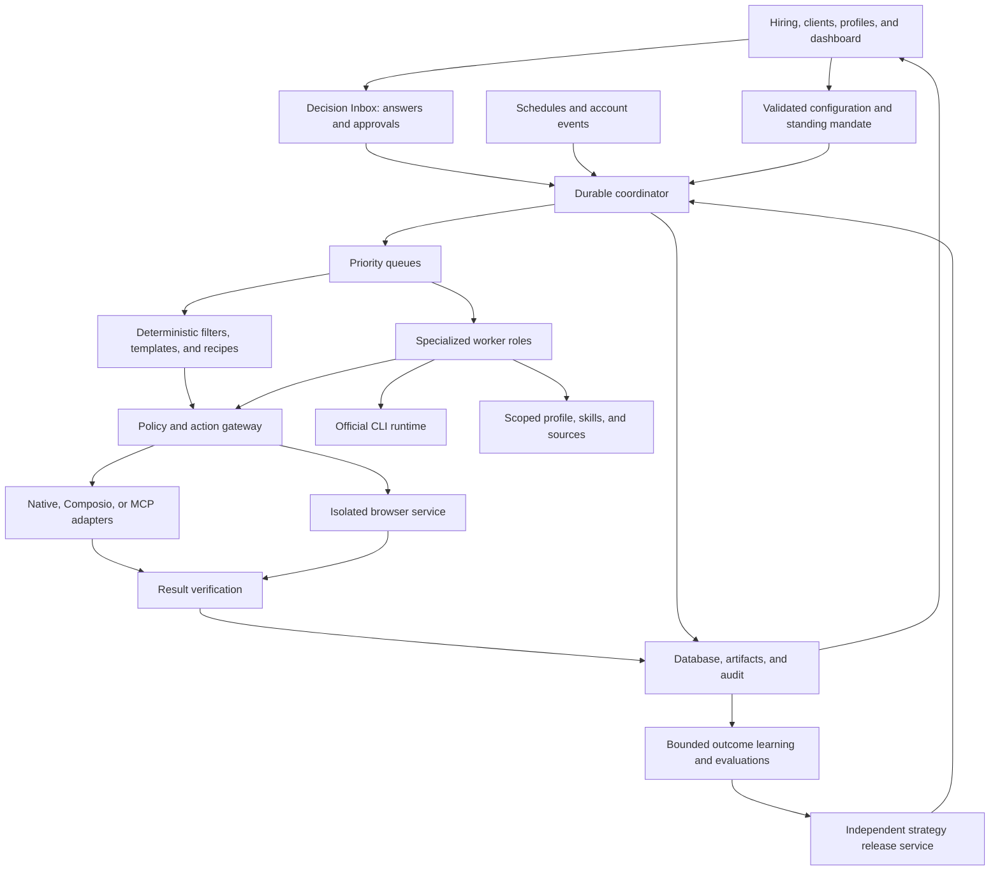

# Architecture and Runtime

> **Implementation note (v0.1.0):** This document describes the target design. See [README](README.md) and [implementation status](IMPLEMENTATION_STATUS.md) for the running local alpha; broader capabilities below remain planned.

## 1. Boundaries

Agent OS consists of a control plane, durable workflow coordinator, bounded agent workers, tool/action gateway, data/knowledge stores, and operational UI. Use the simplest deterministic workflow that satisfies a task. Delegate to specialized model agents only when distinct context, expertise, permissions or evaluation criteria justify it. Independent read/research subtasks can run in parallel; writes to the same conversation or application are serialized. This applies the workflow/agent distinction in Anthropic's guidance [S1].

## 2. Proposed implementation

TypeScript throughout a modular application; Next.js UI/API surface and shared Node worker modules; PostgreSQL for persistent coordination and business state; Redis/BullMQ for work delivery; private file/object storage for artifacts; OpenTelemetry-compatible tracing. Use PostgreSQL full-text/metadata search initially; optional local embeddings must not create a hidden paid model dependency.

One repository has separately supervised app, worker/runner and isolated browser entry points. API, coordinator and connector are modules initially; split processes only for demonstrated isolation or scaling needs. Agent roles are logical definitions, not a microservice each. Isolate browser and expensive rendering workloads from latency-sensitive API workers.

The production target is an always-on private server. Local mode is useful for development and operator-run work; hybrid mode pairs local runners to a server. A sleeping local machine cannot execute its assigned tasks. Persist node health and surface offline work instead of silently moving private context to another machine/provider.

## 3. Subscription execution

Use an official, unmodified Codex CLI or Claude Code CLI behind a versioned adapter. The runtime uses the owner's eligible provider account and documented native login. Keep generic paid model APIs optional and off by default. The provider's supported access, account policy and limits must be checked during setup [S8–S11].

The application must not build a private subscription-token proxy or offer its own replacement Claude.ai login. Credentials remain in the official runtime's credential lifecycle. Hosting/customer-facing expansion requires checking the provider's applicable deployment conditions [S12].

The adapter probes version, effective auth route, capabilities, structured output and readiness. It emits normalized task events; captures reported usage honestly; handles login-required/quota-wait/offline states; and cancels the process tree safely. Never infer unlimited allowance from the number of logical agents.

Use fresh scoped work directories and explicit session IDs. Do not resume an arbitrary “last session.” Do not let inherited host API-key variables silently change billing mode. Run-time prompts include only the necessary pinned configuration, sources and procedures; credentials are excluded.

## 4. Durable execution

Accept and authenticate an event, deduplicate it, persist a workflow and its dependencies, pin the active configuration bundle, then dispatch ready steps through an outbox. Save checkpoints and future timers in PostgreSQL rather than sleeping workers.

Tasks have leases, heartbeats and claim generations. Old workers cannot finalize after a newer claim. Database transactions are short and do not wait for an LLM or remote browser. Queue jobs can be delivered more than once; database step/action identity determines deduplication.

External action states are PREPARED, AUTHORIZED, DISPATCHING, CONFIRMED, FAILED, OUTCOME_UNKNOWN and CANCELLED. A timeout after possible acceptance becomes OUTCOME_UNKNOWN. Reconcile provider/page evidence before considering another equivalent send or submit. A queue lock cannot ensure exactly-once external behavior.

Every real effect passes a gateway check immediately before dispatch: current owner, active grant, current stop rules, entity version, required verified facts, destination, attachment versions and semantic action uniqueness. Tool-level validation matters even when agent input/output guardrails exist [S4].

## 5. Context and data boundaries

The model proposes typed decisions and outputs. Deterministic code enforces authorization, identity, hard preference gates, budgets, filename rules, state transitions and uniqueness. Unknown output fields or unknown policy operators fail validation.

Emails, pages, retrieved documents and MCP descriptions are untrusted content. They can supply evidence or task requests; they cannot grant permissions, change profile facts, publish rules, or disclose secrets. The browser worker has scoped destinations and no generic credential-dump tool.

Each run records configuration bundle, profile, preferences, rules, agent/skill, runtime/model, source and tool-schema versions. The trace includes concise decision summaries and evidence, not a requirement to store hidden model reasoning.

## 6. Autopilot services and enforceable boundaries

Add a standing-mandate evaluator, Decision Inbox service, notification outbox, outcome/evidence ingestion, experiment registry, strategy release service and profile capability registry. These are logical services within the existing process architecture, not one process or model agent per function. A blocked dependency stores a checkpoint and releases its worker; a valid answer emits a deduplicated resume event.

Separate owner-published configuration from automatically promoted strategies. Each task pins both the configuration bundle and applicable strategy version. Strategy publication uses the same transactional version checks, but a distinct narrow service identity with no permission to write rules, grants, verified facts, evaluation policy or budgets. See documents 08–10 for contracts.

Enforce gateway-only effects with scoped tool access, OS/process isolation, restricted network egress and service-held external credentials. A model runtime must not possess arbitrary authenticated write access through shell, browser or connector side channels. Browser steps capable of writes are dispatched through the action service; a generic unrestricted browser session is not an equivalent boundary. Test bypass attempts before enabling autopilot.

Account-wide model concurrency and budgets cover discovery, replies, learning and profile work together. Learning runs at lower priority with reserved limits; it must not starve live recruiter requests. Maintain separate configured browser/session and connector semaphores. A retry after an unknown result always goes through reconciliation, including profile publishing.

## 7. Release 4.0 execution choices

Keep PostgreSQL as durable business/action truth and Redis/BullMQ as delivery. Use Playwright/Chromium for the default local browser, with optional Browserbase transport. Stagehand and alternative agent frameworks are evaluated extensions, not mandatory nested planners. Host native model CLI runners behind a scoped pairing boundary where container login is inappropriate. Demo uses synthetic data/mock responses and cannot dispatch live effects.

Add growth, efficiency, browser and deployment contracts to the validated bundle. Separate hiring applications from client proposals and share a capacity/relationship ledger to prevent conflicting commitments. Cache pure analysis/artifacts by exact dependency version; authorization and effect verification are always fresh. Documents 12–16 define implementation, measurement and clean-install gates. No service split or dependency choice substitutes for the missing implementation.
